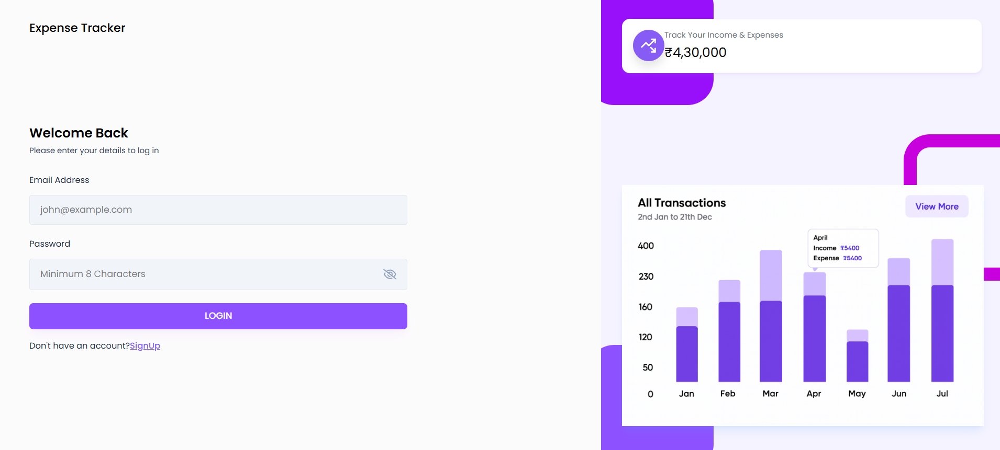
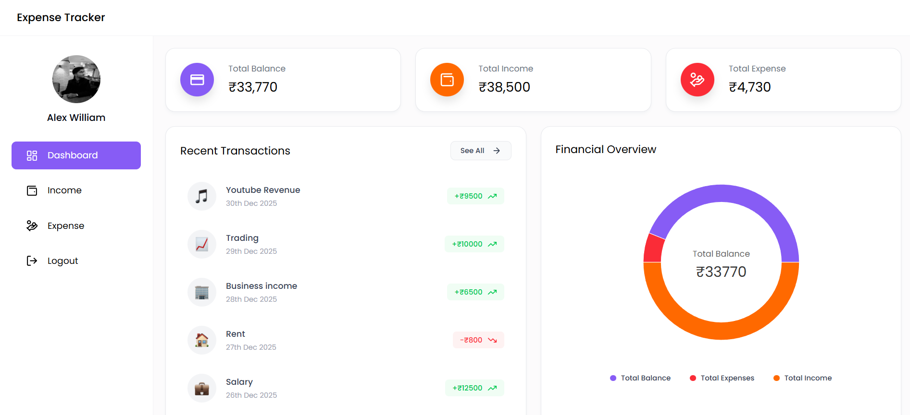
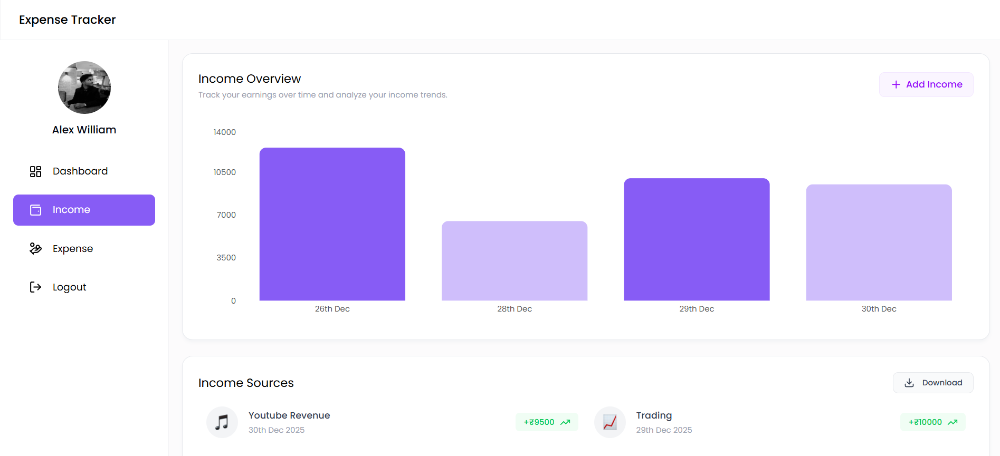
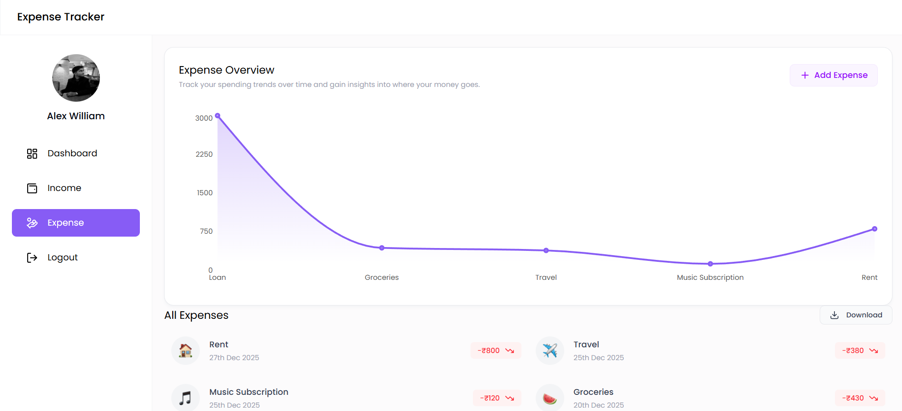

# Expense Tracker

A full‑stack **Expense Tracker application** built with the **MERN stack**, featuring secure authentication, income & expense management, analytics dashboards, charts, file uploads, and data export functionality.

This repository follows a **monorepo architecture**, where the backend and frontend live in separate folders but are maintained in a single codebase.

---

## ✨ Features

### 🔐 Authentication
- JWT‑based authentication
- Secure login & signup
- Protected routes
- User session restoration on refresh

### 💰 Income Management
- Add, view, delete income entries
- Emoji/icon picker for income source
- Income overview with bar & pie charts
- Download income data as Excel

### 💸 Expense Management
- Add, view, delete expense entries
- Expense categorization
- Expense overview & recent transactions
- Download expense data as Excel

### 📊 Dashboard & Analytics
- Total balance calculation
- Last 30 days expenses (bar chart)
- Last 60 days income (pie & bar charts)
- Recent income & expense activity
- Interactive charts using Recharts

### 📁 File Uploads
- Profile image upload support
- Multer‑based local file handling

---

## 🧱 Tech Stack

### Backend
- **Node.js**
- **Express (ES Modules)**
- **MongoDB + Mongoose**
- **JWT Authentication**
- **Cloudinary** (file uploads)
- **Multer** (file uploads)
- **bcrypt** (password hashing)
- **xlsx** (Excel export)

### Frontend
- **React (Vite)**
- **React Router DOM**
- **Tailwind CSS**
- **Axios**
- **Recharts**
- **Emoji Picker React**
- **Moment.js**

---

## 📂 Monorepo Structure

```
expense-tracker/
│
├── backend/
│   ├── config/
│   ├── controllers/
│   ├── middleware/
│   ├── models/
│   ├── routes/
│   ├── uploads/
│   ├── server.js
│   └── package.json
│
└── frontend/
    ├── public/
    ├── src/
    │   ├── components/
    │   ├── context/
    │   ├── hooks/
    │   ├── pages/
    │   ├── utils/
    │   ├── App.jsx
    │   └── main.jsx
    └── package.json
```

---

## ⚙️ Environment Variables

### Backend (`backend/.env`)
Create a `.env` file in the backend folder:

```
PORT=5000
MONGO_URI=your_mongodb_connection_string
JWT_SECRET=your_jwt_secret
```

### Frontend
No environment variables are required by default.  
(If you deploy later, you can add `VITE_API_BASE_URL`.)

---

## 🚀 Getting Started (Local Setup)

### 1️⃣ Clone the repository

```bash
git clone https://github.com/Sarg3n7/expense-tracker.git
cd expense-tracker
```

---

### 2️⃣ Backend Setup

```bash
cd backend
npm install
npm run dev
```

Backend will run on:
```
http://localhost:5000
```

---

### 3️⃣ Frontend Setup

```bash
cd frontend
npm install
npm run dev
```

Frontend will run on:
```
http://localhost:5173
```

---

## 🔌 API Overview (High Level)

| Feature | Endpoint |
|------|---------|
| Auth | `/api/v1/auth` |
| Dashboard | `/api/v1/dashboard` |
| Income | `/api/v1/income` |
| Expense | `/api/v1/expense` |
| Uploads | `/uploads` |

(All protected routes require JWT in Authorization header.)

---

## 🧪 Scripts

### Backend
```bash
npm run dev     # Development (nodemon)
npm start       # Production
```

### Frontend
```bash
npm run dev
npm run build
npm run preview
```

---

## 🤝 Contributing

Contributions are welcome!

### How to contribute:
1. Fork the repository
2. Create a new branch  
   ```bash
   git checkout -b feature/your-feature-name
   ```
3. Commit your changes  
   ```bash
   git commit -m "Add: meaningful message"
   ```
4. Push to your fork  
   ```bash
   git push origin feature/your-feature-name
   ```
5. Open a Pull Request

---

## 🛣️ Future Improvements
- Dark / Light theme toggle
- Cloud storage for uploads (S3 / Cloudinary)
- Monthly & yearly reports
- Budget limits & alerts
- CSV export support
- Deployment with Docker

---

## 📸 Screenshots
### Login Page


### Dashboard


### Income Overview Section


### Expense Overview Section

---

## 📜 License
This project is open‑source and available under the **MIT License**.

---

## 👤 Author
Built with ❤️ by Shashwat Shivam. 
 Github: `https://github.com/Sarg3n7`
